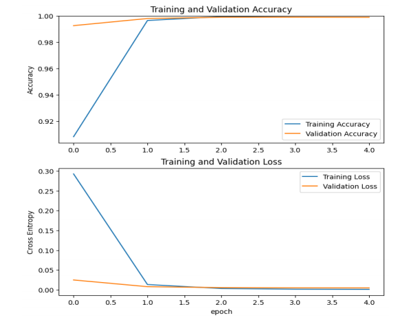
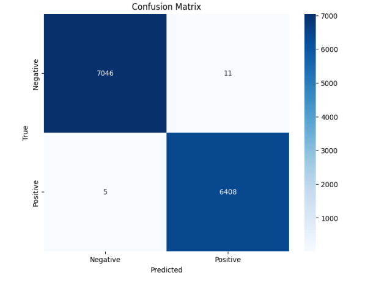

# Phát Hiện Tin Giả Sử Dụng Mạng Nơ-ron Tích Chập (CNN)
Tổng Quan Dự Án
Dự án này, được thực hiện bởi Nhóm 3 thuộc Khoa Toán - Cơ - Tin học, Trường Đại học Khoa học Tự nhiên, Đại học Quốc gia Hà Nội, tập trung vào việc phát hiện và phân loại tin giả bằng Mạng Nơ-ron Tích Chập (CNN). Nghiên cứu ứng dụng các kỹ thuật học sâu để xử lý dữ liệu ngôn ngữ tự nhiên và phân biệt giữa tin thật và tin giả, nhằm giảm thiểu tác động tiêu cực của thông tin sai lệch đối với xã hội.
Dự án là một phần của môn học Phương pháp Nghiên cứu Khoa học, dưới sự hướng dẫn của TS. Lê Huy Hoàng, và được hoàn thành vào tháng 12 năm 2024.
# Thành Viên Nhóm

## Nguyễn Thị Ánh (22000070)
## Nguyễn Thành Trung (22001672)
## Nguyễn Tiến Đạt (22000081)

# Mục Tiêu

Xây dựng mô hình phân loại tự động để nhận diện các bài báo giả mạo hoặc thiếu độ tin cậy bằng CNN.
Đánh giá hiệu suất mô hình thông qua các chỉ số như Độ chính xác (Accuracy), Độ chính xác (Precision), Độ phủ (Recall) và F1-score.
Thiết lập khung lý thuyết cho việc ứng dụng CNN trong xử lý ngôn ngữ tự nhiên (NLP) và phân loại văn bản.
Góp phần giảm thiểu sự lan truyền của thông tin sai lệch và nâng cao niềm tin của công chúng vào các nguồn thông tin.

# Phương Pháp Thực Hiện
Dự án tuân theo một quy trình có cấu trúc:

Thu thập Dữ liệu: Sử dụng bộ dữ liệu ISOT (Integrated Student Outcomes Toolkit) chứa các bài báo thật và giả, được lấy từ ISOT Fake News Detection Datasets.
Tiền xử lý Dữ liệu:
Loại bỏ từ dừng (stopwords), dấu câu, URL và ký tự số.
Chuyển đổi văn bản về chữ thường và mã hóa bằng Keras Tokenizer.
Áp dụng nhúng từ (word embeddings, ví dụ: Word2Vec, GloVe) để biểu diễn từ dưới dạng vector.

# Kiến trúc Mô hình:
Lớp Nhúng (Embedding): Ánh xạ từ thành vector 300 chiều.
Lớp Tích Chập (Conv1D): Trích xuất đặc trưng với 64 bộ lọc, kích thước hạt nhân là 3 và hàm kích hoạt ReLU.
Lớp Global Max Pooling: Giảm kích thước dữ liệu, giữ lại các đặc trưng quan trọng.
Lớp Kết nối Đầy đủ (Fully Connected): 128 nơ-ron với hàm kích hoạt ReLU và dropout (0.5) để tránh quá khớp.
Lớp Đầu ra (Output): Hàm kích hoạt Sigmoid cho phân loại nhị phân (thật/giả).

# Huấn luyện:
Sử dụng bộ tối ưu Adam và hàm mất binary cross-entropy.
Huấn luyện trên các chuỗi đệm (độ dài tối đa: 1000 từ) với kích thước batch 512 trong 5 epoch.

Đánh giá: Đánh giá hiệu suất mô hình trên tập kiểm tra bằng các chỉ số tiêu chuẩn.

# Kết Quả

Mô hình CNN đạt độ chính xác cao (lên đến 99,97% trên tập huấn luyện và 99,90% trên tập kiểm tra) trong việc phân loại tin thật và giả.
Mô hình thể hiện tính mạnh mẽ khi xử lý dữ liệu văn bản thực tế, được chứng minh qua các dự đoán trên các bài báo mẫu:
Tin thật: Độ tin cậy ~99,99%.
Tin giả: Độ tin cậy gần 0%.

# Tài Liệu Tham Khảo

I. K. Sastrawan, I. Bayupati, và D. M. S. Arsa, "Phát hiện tin tức giả bằng phương pháp học sâu dựa trên CNN-RNN," CNTT chuyên phát nhanh, tập 8, số 3, trang 396–408, 2022.
J. A. Nasir, O. S. Khan, và I. Varlamis, "Phát hiện tin tức giả: Phương pháp học sâu kết hợp giữa CNN-RNN," Tạp chí Quốc tế về Dữ liệu Quản lý Thông tin, tập 1, số 1, trang 100007, 2021.
Bộ dữ liệu ISOT Fake News Detection: Link.

Lời Cảm Ơn
Chúng tôi xin cảm ơn TS. Lê Huy Hoàng vì sự hướng dẫn tận tình và đội ngũ ISOT vì đã cung cấp bộ dữ liệu. Dự án này được thực hiện trong khuôn khổ môn học Phương pháp Nghiên cứu Khoa học tại Trường Đại học Khoa học Tự nhiên, Đại học Quốc gia Hà Nội, Việt Nam.
